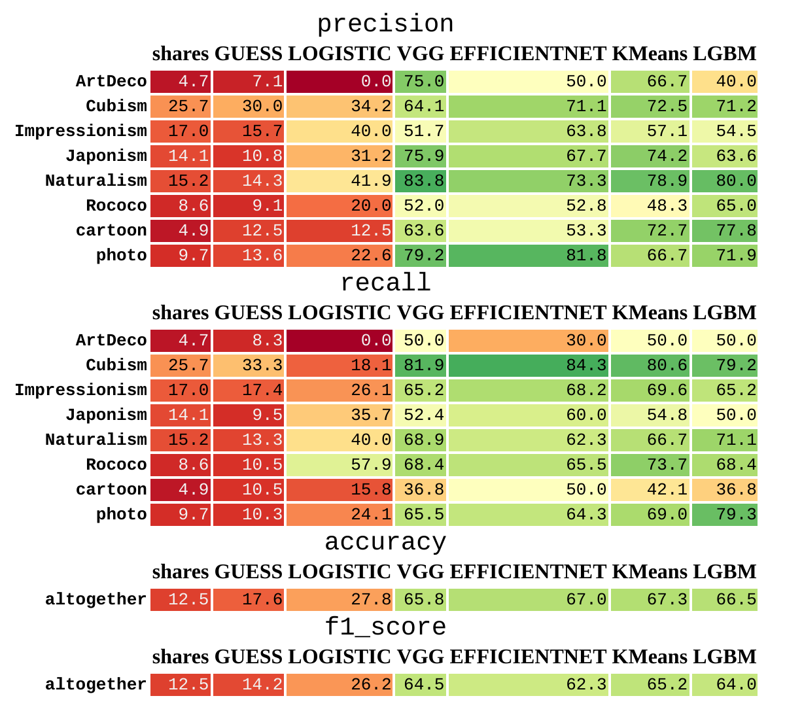

# Taine

A project on image style identification via various approaches from computer vision field.

## Contents
1. [Data overview](notebooks/00_ANALYSIS.ipynb)
2. [Vanilla logistic regression](notebooks/01_LOGISTIC.ipynb)
1. [VGG7, Cross-Entropy](notebooks/02_VGG.ipynb)
1. [EfficientNet_B2 pretrained on ImageNet, fine-tuned via TripletLoss](notebooks/03_EFFICIENTNET.ipynb)
1. [VGG7 embeddings + PCA + KMeans clustering](notebooks/04_KMeans.ipynb)
1. [VGG7 embeddings + PCA + LGBM](notebooks/05_LGBM.ipynb)
1. [Models metrics comparison](notebooks/06_SUMMARY.ipynb)

## Metrics comparison

### Notes

The project is named after Hippolyte Taine — a French historian, critic, and philosopher from the 19th century.
In his Philosophie de l'art book he considers an artwork not as a self-contained message, but rather as a representative of a bigger cluster of artist's creations characterized by his style.
That cluster, in turn, is a part of a bigger group of artworks sharing a common epoch and region. And further those groups are a part of human art history.
