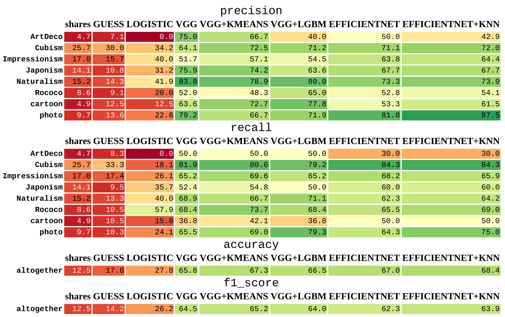

# Taine

A project on image style identification via various approaches from computer vision field.

## Contents
0. [Data overview](notebooks/00_ANALYSIS.ipynb)
1. [Vanilla logistic regression](notebooks/01_LOGISTIC.ipynb)
2. [VGG7, Cross-Entropy](notebooks/02_VGG.ipynb)
3. [VGG7 embeddings + PCA + KMeans clustering](notebooks/03_VGG+KMEANS.ipynb)
4. [VGG7 embeddings + PCA + LGBM](notebooks/04_VGG+LGBM.ipynb)
5. [EfficientNet_B2 pretrained on ImageNet, fine-tuned via TripletLoss](notebooks/05_EFFICIENTNET.ipynb)
6. [EfficientNet_B2 embeddings + PCA + TSNE](notebooks/06_EFFICIENTNET+TSNE.ipynb)
7. [EfficientNet_B2 embeddings + PCA + KNN](notebooks/07_EFFICIENTNET+KNN.ipynb)
8. [Models metrics comparison](notebooks/08_SUMMARY.ipynb)

## Metrics comparison

## Cluster separability illustration

### Notes

The project is named after Hippolyte Taine — a French historian, critic, and philosopher from the 19th century.
In his *Philosophie de l'art* book he considers an artwork not as a self-contained message, but rather as a representative of a bigger cluster of artist's creations characterized by his style.
That cluster, in turn, is a part of a bigger group of artworks sharing a common epoch and region. And further those groups are a part of human art history.
